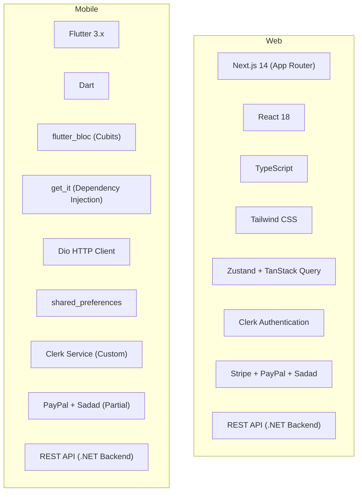
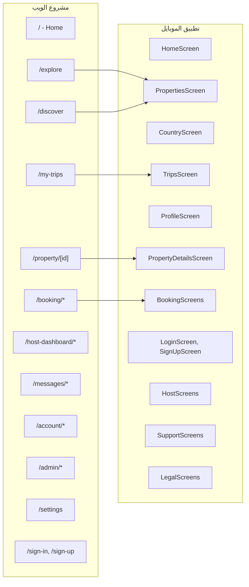
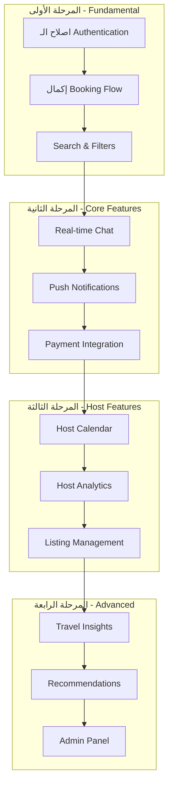
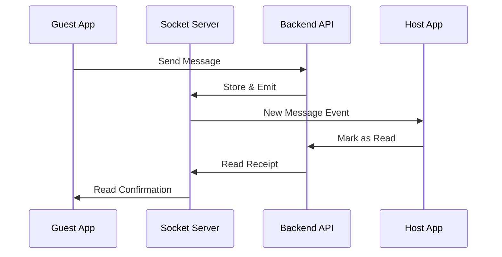

# Houseiana Mobile App - خطة التطوير الشاملة

## ملخص تنفيذي

هذا المستند يوثق التحليل المقارن بين مشروع الويب **Houseiana-Holidays-Homes-main-web** وتطبيق الموبايل الحالي **Houseiana-mobile-main**. يقدم خطة تطوير شاملة لسد الفجوات بين المشروعين وتحقيق تجربة مستخدم موحدة.

---

## القسم الأول: مقارنة المشروعين

### 1.1 مقارنة الـ Tech Stack



| المكون | الويب | الموبايل | الحالة |
|--------|-------|----------|--------|
| Framework | Next.js 14 | Flutter 3.x | متوفر |
| Language | TypeScript | Dart | متوفر |
| State Management | Zustand + TanStack Query | flutter_bloc | متوفر |
| Authentication | Clerk (متكامل) | Clerk Service (جزئي) | يحتاج تحسين |
| Payments | Stripe, PayPal, Sadad | PayPal + Sadad | Stripe مفقود |
| Maps | Google Maps + Leaflet | Google Maps | متوفر |
| Real-time Chat | Socket.io | غير متوفر | مفقود |
| Push Notifications | Firebase | غير متوفر | مفقود |

### 1.2 مقارنة Design System

#### الألوان (Colors)

| الغرض | الويب | الموبايل | التوافق |
|-------|-------|----------|---------|
| Primary | `#FCC519` (Gold) | `#FCC519` (bioYellow) | مطابق |
| Primary Hover | `#e8b316` | `#F9A825` | مختلف قليلاً |
| Background | `white` | `#F5F5F5` | مختلف |
| Text Primary | `#2d2d2d` | `#1D242B` | متقارب |
| Secondary | - | `#26A69A` | متوفر |

### 1.3 مقارنة الـ Routes/Pages



---

## القسم الثاني: تحليل الـ Features

### 2.1 Features الموجودة في الويب وغير موجودة في الموبايل

| # | Feature | الأولوية | التعقيد | الوصف |
|---|---------|----------|---------|-------|
| 1 | **Real-time Chat** | عالية | عالي | نظام رسائل فوري بين Guest و Host باستخدام Socket.io |
| 2 | **Map View في البحث** | عالية | متوسط | عرض العقارات على الخريطة مع تصفية |
| 3 | **Stripe Payments** | عالية | عالي | دعم الدفع بـ Stripe |
| 4 | **Travel Insights** | متوسطة | متوسط | إحصائيات السفر (المال، الليالي، النقاط) |
| 5 | **Host Calendar** | عالية | عالي | تقويم الحجوزات لل Host |
| 6 | **Property Review System** | متوسطة | متوسط | تقييم العقارات بعد الإقامة |
| 7 | **Admin Panel** | متوسطة | عالي | لوحة تحكم Admin |
| 8 | **Recommendations Engine** | منخفضة | عالي | توصيات مخصصة |
| 9 | **Social Sharing** | منخفضة | منخفض | مشاركة الرحلات والعقارات |
| 10 | **KYC Verification UI** | متوسطة | متوسط | واجهة التحقق من الهوية |

### 2.2 Features الموجودة جزئياً في الموبايل

| # | Feature | الحالة الحالية | ما ينقص |
|---|---------|---------------|---------|
| 1 | **Booking Flow** | جزء من الـ Flow | Payment Screen، Confirmation، Cancel flow |
| 2 | **Search & Filters** | أساسي | Map view، Price range slider، Advanced filters |
| 3 | **Host Dashboard** | جزئي | Calendar، Earnings، Analytics |
| 4 | **Profile Settings** | جزئي | Connected services، Privacy settings |
| 5 | **Authentication** | جزئي | Social login، Session management |

### 2.3 Features الموجودة في الموبايل وغير موجودة في الويب

| # | Feature | ملاحظات |
|---|---------|---------|
| 1 | **Country/City Discovery** | شاش CountryScreen مخصصة |
| 2 | **Onboarding Flow** | تجربة onboarding للمستخدمين الجدد |

---

## القسم الثالث: خطة التطوير المفصلة

### 3.1 ترتيب الأولويات



### 3.2 المرحلة الأولى: Fundamental ( الاساسية )

#### Task 1.1: إصلاح وتحسين Authentication System

**الوصف:**
تحسين نظام المصادقة ليعمل بشكل كامل ومتكامل مع Clerk backend.

**الـ Cubits involved:**
- `AuthCubit`
- `UserSession`

**الخطوات:**
1. مراجعة `ClerkService` والتأكد من التكامل الصحيح
2. إضافة Social Login (Google, Apple)
3. تحسين Session Management
4. إضافة OTP Verification Flow كامل
5. إضافة Password Reset/Forgot Password

**المشاكل المحتملة:**
- Clerk SDK لا يعمل مباشرة مع Flutter
- يحتاج Custom Implementation

**الحل:**
استخدام Clerk's Backend API مباشرة مع Dio

---

#### Task 1.2: إكمال Booking Flow

**الوصف:**
إكمال دورة الحجز بالكامل من البحث حتى التأكيد.

**الشاشات المطلوب إكمالها:**

| الشاشات الموجودة | الشاشات المفقودة |
|----------------|------------------|
| DateSelectionScreen | موجودة |
| GuestSelectionScreen | موجودة |
| BookingRequestScreen | موجودة |
| PaymentMethodScreen | موجودة |
| PaymentScreen | جزئي |
| BookingConfirmationScreen | موجودة |
| PaymentPendingScreen | موجودة |
| PaymentFailedScreen | موجودة |
| PaymentCancelScreen | موجودة |
| - | **Payment Success/Return Screen** مفقود |
| - | **Booking Success Animation** مفقود |

**الخطوات:**
1. إكمال `PaymentScreen` للتكامل مع PayPal
2. إضافة Sadad payment flow
3. إضافة Stripe payment (المرحلة الثانية)
4. إضافة Booking Success animation
5. إضافة Payment Return handling

---

#### Task 1.3: تحسين Search & Filters

**الوصف:**
إضافة جميع خيارات البحث والتصفية المتاحة في الويب.

**ما هو موجود حالياً:**
- SearchModalScreen (أساسي)

**ما ينقص:**

| Feature | الوصف |
|---------|-------|
| Map Full Screen | عرض الخريطة كامل مع markers |
| Advanced Filters | فلتر متقدم (Bedrooms, Beds, Bathrooms) |
| Price Range Filter | Slider للسعر |
| Amenities Filter | اختيار amenities |
| Property Type Filter | شقة، فيلا، كابينة، إلخ |
| Instant Book Filter | حجز فوري |
| Superhost Filter | مضيفون مميزون |
| Map/List Toggle | التبديل بين الخريطة والقائمة |

---

### 3.3 المرحلة الثانية: Core Features

#### Task 2.1: Real-time Chat System

**الاولوية:** عالية | **التعقيد:** عالي

**الوصف:**
إضافة نظام رسائل فوري بين Guest و Host.

**الـ Architecture:**



**المكونات المطلوبة:**

| Component | الوصف |
|-----------|-------|
| `ChatCubit` | State management للـ chat |
| `ChatService` | API calls للرسائل |
| `SocketService` | Socket.io connection |
| `ChatScreen` | شاشة المحادثة الرئيسية |
| `ConversationScreen` | شاشة المحادثة مع مستخدم |
| `MessageBubble` | Widget للرسائل |
| `ChatInput` | Widget لإدخال الرسالة |

**الخطوات:**
1. إضافة `socket_io_client` للحزمة
2. إنشاء `SocketService` للتعامل مع Socket
3. إنشاء `ChatCubit` لإدارة الحالة
4. إنشاء `ConversationModel` و `MessageModel`
5. بناء `ChatScreen` و `ConversationScreen`
6. إضافة Push notifications للرسائل الجديدة

---

#### Task 2.2: Push Notifications

**الاولوية:** عالية | **التعقيد:** متوسط

**الوصف:**
إضافة إشعارات Push للمستخدمين.

**المكونات المطلوبة:**

| Component | الوصف |
|-----------|-------|
| `FirebaseService` | Firebase Cloud Messaging |
| `NotificationCubit` | إدارة حالة الإشعارات |
| `NotificationModel` | نموذج الإشعار |
| `NotificationsScreen` | شاشة الإشعارات |

**الخطوات:**
1. إضافة `firebase_messaging` package
2. إعداد Firebase project
3. إنشاء `FirebaseService`
4. إنشاء `NotificationCubit`
5. بناء `NotificationsScreen`
6. إضافة Deep linking للإشعارات

---

#### Task 2.3: Payment Integration - Stripe

**الاولوية:** عالية | **التعقيد:** عالي

**الوصف:**
إضافة دعم Stripe للدفع.

**الخطوات:**
1. إضافة `stripe_payment` package
2. إنشاء `StripeService`
3. إضافة Stripe SDK initialization
4. بناء Stripe payment flow
5. إضافة Webhook handling

---

### 3.4 المرحلة الثالثة: Host Features

#### Task 3.1: Host Calendar

**الاولوية:** عالية | **التعقيد:** عالي

**الوصف:**
تقويم كامل لل Host لإدارة الحجوزات والتوفر.

**الشاشة المطلوبة:**
`AvailabilityCalendarScreen` (موجودة جزئياً)

**ما ينقص:**
- عرض booked dates
- إضافة blocked dates
- تعديل الأسعار الخاصة

---

#### Task 3.2: Host Analytics Dashboard

**الاولوية:** متوسطة | **التعقيد:** متوسط

**الوصف:**
إضافة إحصائيات لل Host.

**المقاييس المطلوبة:**

| Metric | الوصف |
|--------|-------|
| Total Earnings | إجمالي الأرباح |
| This Month | أرباح هذا الشهر |
| Booking Rate | نسبة الحجوزات |
| Views | عدد المشاهدات |
| Guest Satisfaction | رضا الضيوف |

---

#### Task 3.3: Advanced Listing Management

**الاولوية:** متوسطة | **التعقيد:** عالي

**الوصف:**
إكمال جميع خطوات إضافة وإدارة العقارات.

**الشاشات:**

| الشاشة | الحالة |
|--------|--------|
| `ListPropertyScreen` | موجودة |
| `PropertySetupScreen` | موجودة |
| `PricingSetupScreen` | موجودة |
| `AvailabilityCalendarScreen` | جزئية |
| - | Photos Upload Screen مفقود |
| - | Amenities Selection مفقود |
| - | Location Picker مفقود |
| - | Description Editor مفقود |

---

### 3.5 المرحلة الرابعة: Advanced Features

#### Task 4.1: Travel Insights

**الاولوية:** منخفضة | **التعقيد:** متوسط

**الوصف:**
إضافة إحصائيات السفر للمستخدم.

---

#### Task 4.2: Recommendations Engine

**الاولوية:** منخفضة | **التعقيد:** عالي

**الوصف:**
إضافة توصيات مخصصة للمستخدم.

---

#### Task 4.3: Admin Panel (Mobile)

**الاولوية:** منخفضة | **التعقيد:** عالي

**الوصف:**
إضافة لوحة تحكم Admin مختصرة للموبايل.

---

## القسم الرابع: خطة Migration للـ Architecture

### 4.1 Current Architecture

```
lib/
├── core/
│   ├── constants/
│   ├── errors/
│   ├── network/
│   ├── services/
│   ├── theme/
│   └── utils/
├── features/
│   ├── auth/
│   ├── booking/
│   ├── chat/
│   ├── dashboard/
│   ├── discover/
│   ├── favorites/
│   ├── home/
│   ├── host/
│   ├── messages/
│   ├── notifications/
│   ├── profile/
│   ├── properties/
│   ├── property_details/
│   ├── search/
│   ├── splash/
│   ├── support/
│   └── trips/
└── main.dart
```

### 4.2 المشاكل في Architecture الحالي

1. **Services موزعة** - بعض الخدمات في `core/services` وبعضها داخل features
2. **Dependency Injection غير منتظمة** - استخدام `get_it` لكن ليس بشكل متسق
3. **State Management غير متسق** - Mix بين Cubits و local state
4. **Repository Pattern مفقود** - Direct API calls من Cubits

### 4.3 Proposed Architecture (Clean Architecture)

```
lib/
├── core/
│   ├── constants/
│   ├── di/                         # Dependency Injection
│   ├── errors/
│   ├── network/
│   │   ├── api/
│   │   └── socket/
│   ├── theme/
│   └── utils/
├── data/
│   ├── datasources/
│   │   ├── local/
│   │   └── remote/
│   ├── models/
│   └── repositories/
├── domain/
│   ├── entities/
│   ├── repositories/
│   └── usecases/
├── presentation/
│   ├── blocs/
│   ├── pages/
│   └── widgets/
└── main.dart
```

### 4.4 Migration Steps

| Phase | Task | الوصف |
|-------|------|-------|
| 1 | Setup DI | إعداد `get_it` بشكل صحيح |
| 2 | Create Base Classes | BaseCubit, BaseRepository |
| 3 | Migrate Auth | Migrate AuthFeature to Clean |
| 4 | Migrate Properties | Migrate PropertiesFeature |
| 5 | Migrate Booking | Migrate BookingFeature |
| 6 | Migrate Rest | Migrate remaining features |

---

## القسم الخامس: Recommendations لتحسين الـ Performance

### 5.1 Image Loading & Caching

```dart
// استخدام CachedNetworkImage بشكل متسق
CachedNetworkImage(
  imageUrl: property.imageUrl,
  fit: BoxFit.cover,
  placeholder: (context, url) => ShimmerEffect(),
  errorWidget: (context, url, error) => PropertyPlaceholder(),
  cacheManager: CustomCacheManager(), // Custom cache settings
)
```

### 5.2 List Performance

```dart
// استخدام ListView.builder بدلاً من ListView
ListView.builder(
  itemCount: properties.length,
  itemBuilder: (context, index) => PropertyCard(properties[index]),
)

// استخدام pagination
```

### 5.3 State Management Optimization

```dart
// استخدام Equatable بشكل صحيح
class PropertyState extends Equatable {
  final List<Property> properties;
  final bool isLoading;
  final String? error;
  
  @override
  List<Object?> get props => [properties, isLoading, error];
}
```

### 5.4 Network Optimization

```dart
// استخدام Dio interceptors
class CacheInterceptor extends Interceptor {
  // Add caching logic
}

// Add retry logic
RetryInterceptor(
  dio: dio,
  retries: 3,
  retryInterval: Duration(seconds: 1),
)
```

---

## القسم السادس: المشاكل المحتملة والحلول

### 6.1 Authentication Issues

| المشكلة | الحل |
|---------|------|
| Clerk doesn't support Flutter directly | Use Clerk's Backend API via Dio |
| Session management complexity | Create custom `UserSession` service |
| Token refresh issues | Implement automatic token refresh |

### 6.2 Payment Integration Issues

| المشكلة | الحل |
|---------|------|
| PayPal SDK Flutter support | Use webview_flutter for PayPal |
| Stripe Flutter SDK limitations | Use stripe_js via webview |
| Sadad integration complexity | Follow web implementation |

### 6.3 Real-time Features

| المشكلة | الحل |
|---------|------|
| Socket connection management | Use SocketService singleton |
| Connection drops | Implement auto-reconnect |
| Background state | Use background_isolates |

### 6.4 Performance Issues

| المشكلة | الحل |
|---------|------|
| Large image loading | Implement progressive loading |
| Long lists | Use pagination + lazy loading |
| Memory leaks | Proper dispose of controllers |

---

## القسم السابع: ملخص Tasks

### المرحلة اولى - Fundamental

| # | Task | Dependencies |
|---|------|--------------|
| 1.1 | Fix Authentication System | - |
| 1.2 | Complete Booking Flow | 1.1 |
| 1.3 | Improve Search & Filters | - |

### المرحلة الثانية - Core Features

| # | Task | Dependencies |
|---|------|--------------|
| 2.1 | Real-time Chat System | 1.1 |
| 2.2 | Push Notifications | 2.1 |
| 2.3 | Stripe Payment | 1.2 |

### المرحلة الثالثة - Host Features

| # | Task | Dependencies |
|---|------|--------------|
| 3.1 | Host Calendar | 2.1 |
| 3.2 | Host Analytics | 3.1 |
| 3.3 | Listing Management | 3.1 |

### المرحلة الرابعة - Advanced

| # | Task | Dependencies |
|---|------|--------------|
| 4.1 | Travel Insights | 1.2 |
| 4.2 | Recommendations | - |
| 4.3 | Admin Panel | - |

---

## القسم الثامن: Next Steps

1. **مراجعة الخطة** من قبل فريق التطوير
2. **الموافقة** على الأولويات والتسلسل
3. **بدء المرحلة الأولى** - Task 1.1: إصلاح Authentication
4. **Setup CI/CD** للمراجعة المستمرة
5. **إنشاء MVP** للـ Booking Flow

---

## الملاحق

### A. API Endpoints Reference

| Endpoint | Method | الوصف |
|----------|--------|-------|
| `/api/properties` | GET | جلب العقارات |
| `/api/properties/{id}` | GET | جلب عقار محدد |
| `/api/property-search` | GET | البحث مع فلتر |
| `/api/bookings` | POST | إنشاء حجز |
| `/api/favorites` | GET/POST | المفضلة |
| `/api/messages` | GET/POST | الرسائل |
| `/api/payments` | POST | الدفع |

### B. Color Reference

```dart
// Houseiana Brand Colors
const Color bioYellow = Color(0xFFFCC519);
const Color charcoal = Color(0xFF1D242B);
const Color ghostWhite = Color(0xFFF9F9FA);
const Color neutral100 = Color(0xFFF5F5F5);
const Color neutral200 = Color(0xFFE5E7EB);
const Color neutral400 = Color(0xFF9CA3AF);
const Color neutral600 = Color(0xFF4B5563);
```

### C. Package Dependencies Required

```yaml
dependencies:
  flutter:
    sdk: flutter
  
  # State Management
  flutter_bloc: ^9.1.0
  equatable: ^2.0.7
  
  # Dependency Injection
  get_it: ^8.0.3
  
  # Networking
  dio: ^5.7.0
  
  # Real-time
  socket_io_client: ^3.0.2
  
  # Firebase
  firebase_core: ^3.13.0
  firebase_messaging: ^15.2.5
  
  # Payments
  paypal_checkout: ^1.0.8
  stripe_checkout: ^1.0.0
  
  # UI
  cached_network_image: ^3.4.1
  shimmer: ^3.0.0
  flutter_svg: ^2.0.17
  
  # Maps
  google_maps_flutter: ^2.9.0
```

---

**تاريخ الإنشاء:** 2024
**المؤلف:** Architecture Team
